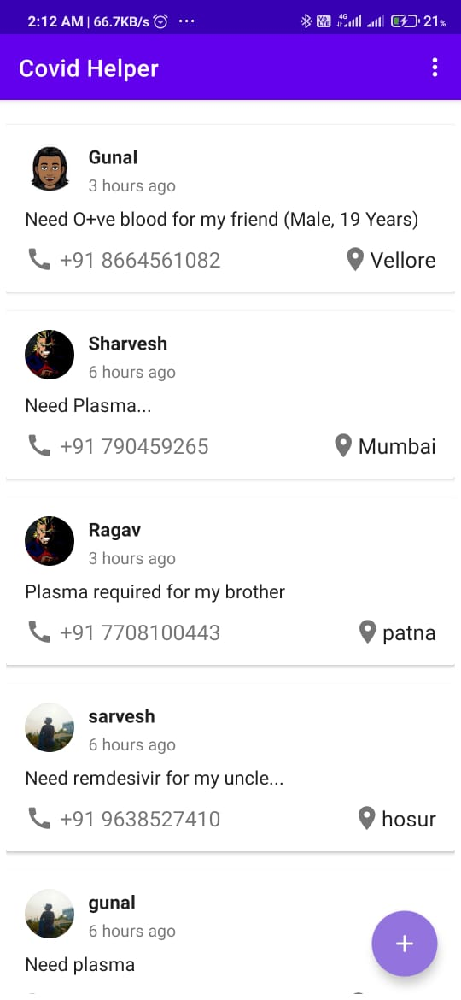
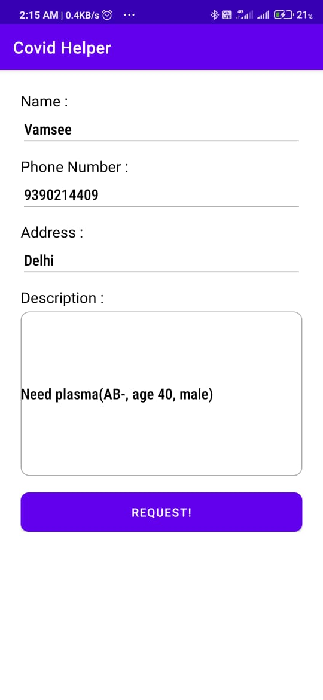
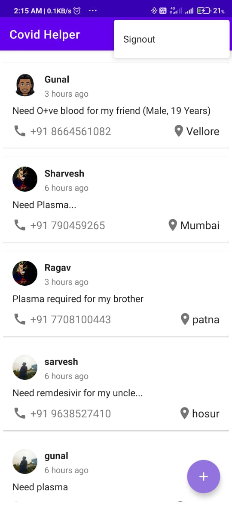

# CovidHelper

## Problem:
 The actual problem here is that the resources that help in the pandemic recovery (Ex. Oxygen cylinders, plasma etc) in this country are unevenly distributed. Hence there's a shortage of these resources. We as a team are here to solve this growing problem.

## Solution/ Features:
We welcome people to donate Plasma, Oxygen Cylinders etc through our app, They can provide their details such as their contact info, location etc. so that the people in need nearby could view their details and contact them.

Sort details location vice to get the nearest available donor/ helper.

People can register with our application and get all the benefits. 

## Tech Stack:
	Kotlin, Android Studio, Firebase Fire Store, Git, Github.
  
## Screenshots

  <space/>      
